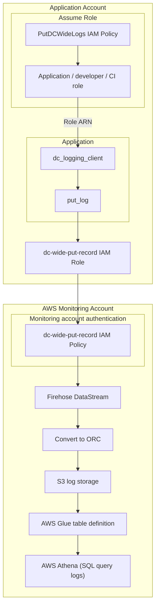

# DC Logging

## Client
A python library for submitting log events form applications.

The logging client provides four things:

1. A `Logger` class that manages submitting log events
2. Managed log stream classes
3. Classes for creating log entries
4. Validation that everything is being used properly

### Installation

Install the desired version using pip or pipenv.

For pipenv, especially on projects deployed on AWS Lambda, it's advised to use
the `zip` package from the release page:

`pipenv install https://github.
com/DemocracyClub/dc_logging/archive/refs/tags/[VERSION].zip`


### Using the library

#### Logging classes

The library contains a single logger class per log stream. A log stream 
represents the category of log, and all logs for a single stream are stored 
together.

##### DCWidePostcodeLoggingClient
Currently, there is a single log stream defined: `DCWidePostcodeLoggingClient`.

This is designed to log all postcodes entered from any DC site. Care should 
be taken not to "double count" entered postcodes. For example, if an app is 
processing a lookup from another project that also logs postcodes, make sure 
that only one log entry is created per search.


#### Create a logger

It's recommended that loggers are  created globally to the application, for 
example in a Django settings module.

```python
# settings.py
from dc_logging_client.log_client import DCWidePostcodeLoggingClient
POSTCODE_LOGGER = DCWidePostcodeLoggingClient
```

#### Create an entry

At the point you want to create a log entry

```python
from dc_logging_client.log_client import DCWidePostcodeLoggingClient
POSTCODE_LOGGER = DCWidePostcodeLoggingClient()
entry = POSTCODE_LOGGER.entry_class(
    postcode="SW1A 1AA", 
    dc_product=POSTCODE_LOGGER.dc_product.wcivf
)
```

Note the `dc_product`. This is an Enum that is validated against a set of known
and supported DC products. If you are trying to use this library in a DC
product that's not supported then please make a PR to this repo.

And log it

````python
POSTCODE_LOGGER.log(entry)
````


### AWS services

Logs are submitted to [AWS Kenisis Firehose](https://aws.amazon.com/kinesis/data-firehose/).

Understanding Firehose fully shouldn't be required, but some high level 
basics are useful:

Firehose provides _log streams_ that are essentially endpoints that accept data.

Each stream can be configured to process the data in various way. For 
example, by putting it in S3, calling a AWS Lambda function, adding to a 
relational database, etc etc.

Firehose doesn't validate the incoming data, so it's important that clients 
write constantly.

This library mainly attempts to manage this consistency. 

### Authentication

The logging client hands authentication over to AWS. AWS only allows logging 
from an authenticated IAM user in its own account.

This is unlike e.g RDS that has a host URL that anyone can connect to (if 
permission is so given). Firehose just uses _log stream names_ in the 
authenticated account.

As DC uses an AWS account per (service, stage), we need to consider how we 
authenticate against the stream we want to post to.

The simplest and safest way, from the client users's point of is to use 
AWS's _assume role_ via 
[Security Token Service](https://docs.aws.amazon.com/STS/latest/APIReference/welcome.html).

This is essentially a service that lets IAM users "assume" a different role, 
including across accounts. Think of it a little like `su`.

On the _sending_ side, the role the appliation is running under needs to have 
a policy associated with it that allows assuming a role.

On the _receiving_ side (the AWS account with the target Firehose log stream)
there needs to be a policy that allows thr sending IAM policy to connect.




The end result of this is that the client needs two things:

1. To be running in an environment that has permission to _assume role_ in 
   to the target account
2. The ARN of the role to assume

For an EC2 instance or Lambda function this means attaching a policy to the 
execution role already attached to the resource.

For local development this means using `SSO` to authenticate. The SSO admin 
will ensure that the policy is attached to your role.

