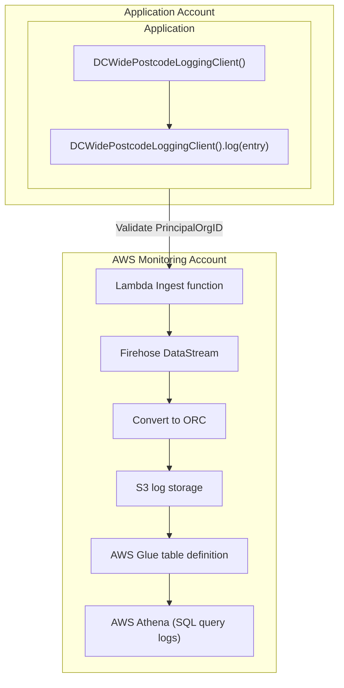

# DC Logging

## Client
A python library for submitting log events form applications.

The logging client provides four things:

1. A `Logger` class that manages submitting log events
2. Managed log stream classes
3. Classes for creating log entries
4. Validation that everything is being used properly

### Local Development

Docker is required on the local system to run test.

* Install Python dependencies: `uv sync`
* Run the test suite: `./scripts/run-tests.sh`
* Run lint checks: `./scripts/code-check.sh`
* Auto-format: `./scripts/code-format.sh`

#### Testing

We use `moto` to test the various AWS moving parts. `moto`
builds (almost) everything from the CDK CloudFormation template. 

If you make change to the Stack, or the first time you install the project, you 
need to run `make cfn_template_for_tests`. This file isn't checked in to Git
as it contains actual values from the deployment. 

### Installation

To install in another project, target the desired version from releases on github.

eg:

* `pip install https://github.com/DemocracyClub/dc_logging/archive/refs/tags/[VERSION].zip`
* `uv add https://github.com/DemocracyClub/dc_logging/archive/refs/tags/[VERSION].zip`
* `pipenv install https://github.com/DemocracyClub/dc_logging/archive/refs/tags/[VERSION].zip`


### Using the library

#### Logging classes

The library contains a single logger class per log stream. A log stream 
represents the category of log, and all logs for a single stream are stored 
together.

##### DCWidePostcodeLoggingClient
Currently, there is a single log stream defined: `DCWidePostcodeLoggingClient`.

This is designed to log all postcodes entered from any DC site. 

If the application in turn calls the developers.democracyclub.org.uk API then
`calls_devs_dc_api` MUST be set to `True`. This will prevent double counting 
usage when querying later.


#### Create a logger

It's recommended that loggers are  created globally to the application, for 
example in a Django settings module.

```python
# settings.py
from dc_logging_client.log_client import DCWidePostcodeLoggingClient
POSTCODE_LOGGER = DCWidePostcodeLoggingClient(function_arn="arn")
```

The ARN to pass in should be the correct one for the log stream (currently
only DCWidePostcodeLoggingClient) and the environment (currently only
development or production). That means at the moment there are only two
possible ARNs here. Find them in the DC dev handbook.

#### Create an entry

At the point you want to create a log entry

```python
entry = POSTCODE_LOGGER.entry_class(
    postcode="SW1A 1AA", 
    dc_product=POSTCODE_LOGGER.dc_product.wcivf
)
```

Note the `dc_product`. This is an Enum that is validated against a set of known
and supported DC products. If you are trying to use this library in a DC
product that's not supported then please make a PR to this repo.

And log it

````python
POSTCODE_LOGGER.log(entry)
````


### AWS services

Logs are submitted initially to a Lambda ingest function and then to
[AWS Kenisis Firehose](https://aws.amazon.com/kinesis/data-firehose/).

Understanding how Firehose works shouldn't be required, but some high 
level basics are useful:

Firehose provides _log streams_ that are essentially endpoints that accept data.

Each stream can be configured to process the data in various way. For 
example, by putting it in S3, calling a AWS Lambda ingest function, adding to a 
relational database, etc.

Firehose doesn't validate the incoming data, so it's important that clients 
write consistently.

This library mainly attempts to manage this consistency.

The initial Lambda ingest function is needed for cross account support: Firehose
doesn't support organisational wide permissions, meaning it's only possible to
write to the account that hosts the log stream. To get around this, we have
a Lambda ingest function per log stream (and environment) that _can_ be called
cross-account, and this function relays the log message on to Firehose.




The end result of this is that the client needs two things:


1. To have a PrincipalOrgID of the DC organisation. This means, is in an account in 
   th DC org, or is an authenticated user in that organisation
2. The function ARN of the ingest function. Take this from the DC dev 
   handbook, and ensure it matches the environment you're deploying to 
   (currently either `development` or `production`). DO NOT LOG TO THE WRONG 
   PLACE

#### Deploying AWS Services

The AWS services are deployed using the CDK. The CDK is a framework for
defining AWS infrastructure as code. It's written in Python, and the code
is in the `dc_logging_aws` directory.

Deployment is done automatically by CircleCI. To deploy manually, you need
to install the CDK and run `cdk deploy` in the root of this repo, with these two
environment variables set for development (production deploys should be handled
by CircleCI):

- `DC_ENVIRONMENT`: `development`
- `LOGS_BUCKET_NAME`: Run `aws s3 ls` to find this, it likely ends with `logging`.

### Querying Athena

The logs are stored in S3 in a format that can be queried using Athena. The logs
are partitioned by day and hour, so in order to query them efficiently you need 
to also specify ranges to filter by. The day is a string in the format 
`YYYY/MM/DD` and the hour is an int. You can use `>`, `<`, `>=`, `<=` etc, and 
also `LIKE` to match a string prefix for the day.

The partitions are based on when the log was sent to S3 by Firehose, not when
the log entry was created. This means that timestamps can be off versus the 
partitions by up to 5 minutes. For precise analysis, you should check the 
`timestamp` field in the log entry.

#### Examples

```sql
-- All of May and June 2023
SELECT dc_product, count(*) FROM "dc-wide-logs"."dc_postcode_searches_table"
WHERE day >= '2023/05' AND day < '2023/07'
GROUP BY 1
```

```sql
-- All of May 3rd 2023, using the timestamp field for precision
SELECT dc_product, count(*) FROM "dc-wide-logs"."dc_postcode_searches_table"
WHERE day IN('2023/05/03', '2023/05/04')
AND timestamp >= cast('2023-05-03' AS timestamp)
AND timestamp < cast('2023-05-04' AS timestamp)
GROUP BY 1
```

```sql
-- All of 2023
SELECT dc_product, count(*) FROM "dc-wide-logs"."dc_postcode_searches_table"
WHERE day LIKE '2023/%'
```

```sql
-- Joining on the local_authorities table
SELECT substr(nuts, 1, 1), count(*) 
FROM "dc-wide-logs"."dc_postcode_searches_table" 
JOIN (select distinct pcds, nuts FROM "local_authorities"."local_authorities") AS las
ON replace("postcode", ' ', '') = replace("las"."pcds", ' ', '')
WHERE "timestamp" >= cast('2023-04-01' AS timestamp)
AND "timestamp" <= cast('2023-05-04 22:00' AS timestamp)
AND day >= '2023/03/31' AND day <= '2023/05/05'
GROUP BY substr(nuts, 1, 1)
```