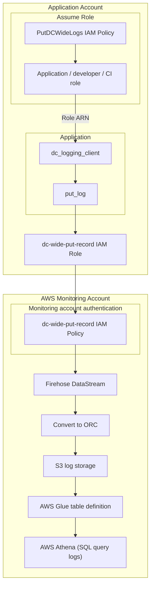

```mermaid
graph TB
    subgraph application_account [" Application Account"]
        direction LR
        subgraph app_sts ["Assume Role"]
                application_policy["PutDCWideLogs IAM Policy"]
                application_role["Application / developer / CI role"]
        end
            
        
        
        subgraph application ["Application"]
            dc_logging_client
            put_log
        end
        application_policy --> application_role
        application_role --> |Role ARN| dc_logging_client
        dc_logging_client --> put_log
        put_log --> monitoring_role
    end

    subgraph aws_monitoring ["AWS Monitoring Account"]
        subgraph assume_role ["Monitoring account authentication"]
            monitoring_role["dc-wide-put-record IAM Role"]
            monitoring_policy["dc-wide-put-record IAM Policy"]
        end
        firehose["Firehose DataStream"]
        convert["Convert to ORC"]
        s3["S3 log storage"]
        glue["AWS Glue table definition"]
        athena["AWS Athena (SQL query logs)"]
        
        monitoring_role --> monitoring_policy --> firehose
        firehose --> convert --> s3
        s3 --> glue --> athena
    end
```
